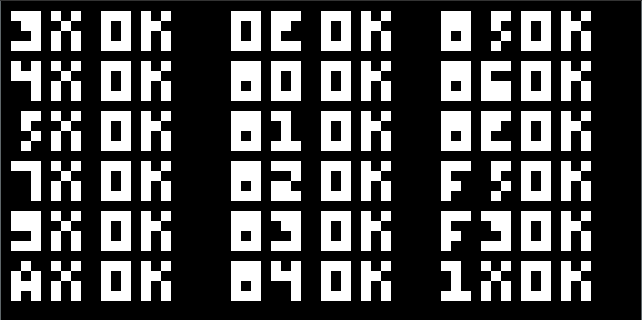

# Building a CHIP-8 Emulator (C++)

> - **Created By**: Austin Morlan
> - **Website**: https://austinmorlan.com/posts/chip8_emulator/

I’ve always loved emulators because they let me play old games that I enjoyed as a kid, so I thought it might be fun to learn how they work and how to build one. My real goal is to build an NES emulator, but after doing some research, I decided to take the advice of the internet and start by building an emulator for the much less complex [CHIP-8](https://en.wikipedia.org/wiki/CHIP-8) instead. It’s a good stepping stone to the NES.

> [!info]
>Technically the CHIP-8 was never a real machine at all but instead a virtual machine. People would write programs for this virtual machine, and then an interpreter would decode the instructions. Because it was virtual, the same programs could run on different machines as long as they had an interpreter. What we're going to create is actually one of those interpreters, but we'll just consider it an emulator.

There are a lot of CHIP-8 emulators out there, and a lot of websites about building them, but I noticed a divide between the two. There might be code without a lot of explanation, or explanations without a lot of code. Those are fine for an experienced programmer who can fill in the gaps, but I want to provide a holistic reference for the inexperienced. Not only do I hope to show how to build a simple emulator, but I also hope to teach some low-level computer fundamentals.

The only requirement is a basic understanding of C++.

- [How Does a CPU Work?](https://austinmorlan.com/posts/chip8_emulator/?ref=codebldr#how-does-a-cpu-work)
- [What is an Emulator?](https://austinmorlan.com/posts/chip8_emulator/?ref=codebldr#what-is-an-emulator)
- [CHIP-8 Description](https://austinmorlan.com/posts/chip8_emulator/?ref=codebldr#chip-8-description)
    - [16 8-bit Registers](https://austinmorlan.com/posts/chip8_emulator/?ref=codebldr#16-8-bit-registers)
    - [4K Bytes of Memory](https://austinmorlan.com/posts/chip8_emulator/?ref=codebldr#4k-bytes-of-memory)
    - [16-bit Index Register](https://austinmorlan.com/posts/chip8_emulator/?ref=codebldr#16-bit-index-register)
    - [16-bit Program Counter](https://austinmorlan.com/posts/chip8_emulator/?ref=codebldr#16-bit-program-counter)
    - [16-level Stack](https://austinmorlan.com/posts/chip8_emulator/?ref=codebldr#16-level-stack)
    - [8-bit Stack Pointer](https://austinmorlan.com/posts/chip8_emulator/?ref=codebldr#8-bit-stack-pointer)
    - [8-bit Delay Timer](https://austinmorlan.com/posts/chip8_emulator/?ref=codebldr#8-bit-delay-timer)
    - [8-bit Sound Timer](https://austinmorlan.com/posts/chip8_emulator/?ref=codebldr#8-bit-sound-timer)
    - [16 Input Keys](https://austinmorlan.com/posts/chip8_emulator/?ref=codebldr#16-input-keys)
    - [64x32 Monochrome Display Memory](https://austinmorlan.com/posts/chip8_emulator/?ref=codebldr#64x32-monochrome-display-memory)
    - [Class Members](https://austinmorlan.com/posts/chip8_emulator/?ref=codebldr#class-members)
- [Loading a ROM](https://austinmorlan.com/posts/chip8_emulator/?ref=codebldr#loading-a-rom)
- [Loading the Fonts](https://austinmorlan.com/posts/chip8_emulator/?ref=codebldr#loading-the-fonts)
- [Random Number Generator](https://austinmorlan.com/posts/chip8_emulator/?ref=codebldr#random-number-generator)
- [The Instructions](https://austinmorlan.com/posts/chip8_emulator/?ref=codebldr#the-instructions)
- [Function Pointer Table](https://austinmorlan.com/posts/chip8_emulator/?ref=codebldr#function-pointer-table)
- [Fetch, Decode, Execute](https://austinmorlan.com/posts/chip8_emulator/?ref=codebldr#fetch-decode-execute)
- [The Platform Layer](https://austinmorlan.com/posts/chip8_emulator/?ref=codebldr#the-platform-layer)
- [The Main Loop](https://austinmorlan.com/posts/chip8_emulator/?ref=codebldr#the-main-loop)
- [Results](https://austinmorlan.com/posts/chip8_emulator/?ref=codebldr#results)
- [Conclusion](https://austinmorlan.com/posts/chip8_emulator/?ref=codebldr#conclusion)
- [Appendix: Bits, Bytes, Etc.](https://austinmorlan.com/posts/chip8_emulator/?ref=codebldr#appendix-bits-bytes-etc)
    - [Binary](https://austinmorlan.com/posts/chip8_emulator/?ref=codebldr#binary)
    - [Hexadecimal](https://austinmorlan.com/posts/chip8_emulator/?ref=codebldr#hexadecimal)
    - [Bits and Bytes](https://austinmorlan.com/posts/chip8_emulator/?ref=codebldr#bits-and-bytes)
    - [AND, OR, NOT, XOR](https://austinmorlan.com/posts/chip8_emulator/?ref=codebldr#and-or-not-xor)
    - [Bitmasking](https://austinmorlan.com/posts/chip8_emulator/?ref=codebldr#bitmasking)
    - [Bit Shifting](https://austinmorlan.com/posts/chip8_emulator/?ref=codebldr#bit-shifting)
- [Source Code](https://austinmorlan.com/posts/chip8_emulator/?ref=codebldr#source-code)

<br />

---

<br />

## How Does a CPU Work?

Before we can talk about emulators, we first need a basic understanding of how a CPU works.

A CPU reads instructions from somewhere in memory that tell it what to do. A CPU may be really fast but it’s stupid. You have to be very explicit and logical to get it to do what you want and you do that using a discrete set of instructions.

For example, consider this instruction for the [CPU inside of the original Game Boy](https://gbdev.io/gb-opcodes/optables/): **$C622**. It encodes an operation and relevant data into a number that a machine can read.

Different instructions are encoded in different ways. In this case, the first byte (**$C6**) says **ADD to Register A**, and the second byte (**$22**) is the value that will be added to Register A. So this instruction says **Add $22 to Register A**.

As explained above, the CHIP-8 was not a real physical CPU but instead a virtual machine with its own instruction set, but the same principles apply. For example, consider the CHIP-8 instruction **$7522**. The first byte (**$75**) says **ADD to Register 5** and the second byte (**$22**) is the value to be added to Register 5. So this instruction says **ADD $22 to Register 5**.

> **$** and **0x** mean that a number is represented in hexadecimal (hex). That is the primary radix used when dealing with computers at a low-level because it's a much more concise way of presenting large values (like memory addresses).  
>  
> See the Appendix for more info.

Way back in the day, programmers would write programs in an **assembly language** rather than the high-level languages (like C++) that we use today. Assembly is as low as you can go while still being human readable. An **assembler** would translate their human-readable assembly into the 1s and 0s that the computer could understand.

Keeping with the earlier example, the assembly program would have **ADD V5, $22**, and the assembler would translate that to **$7522**, which the CHIP-8 interpreter can read. The same thing happens today, only we have another layer above assembly in the form of high-level languages.

<br />

---

<br />

## What is an Emulator?

An emulator reads the original machine code instructions that were assembled for the target machine, interprets them, and then replicates the functionality of the target machine on the host machine. The ROM files contain the instructions, the emulator reads those instructions, and then does work to mimic the original machine.

When an emulator reads the instruction **$7522**, it would emulate the behavior of the CHIP-8 by doing something like this:

```cpp
registers[5] += 0x22;
```

That’s really all there is to it. When emulating more advanced machines you also have to emulate other components like the graphics processor and the sound chip. The CHIP-8 is a nice starting project because the CPU only has 34 instructions, the graphics are simple monochrome pixels, and the sounds are just a single buzzer tone.

<br />

---

<br />

## CHIP-8 Description

We’d like to mimic the components of a CHIP-8 in our emulator, so let’s describe them.

### 16 8-bit Registers

A register is a dedicated location on a CPU for storage. Any operations that a CPU does must be done within its registers. A CPU typically only has a few registers, so long-term data is held in memory instead. Operations often involve loading data from memory into registers, operating on those registers, and then storing the result back into memory.

The CHIP-8 has sixteen 8-bit registers, labeled **V0** to **VF**. Each register is able to hold any value from **0x00** to **0xFF**.

Register VF is a bit special. It’s used as a flag to hold information about the result of operations.

### 4K Bytes of Memory

There is relatively little register-space (because it’s expensive), so a computer needs a large chunk of general memory dedicated to holding program instructions, long-term data, and short-term data. It references different locations in that memory using an **address**.

The CHIP-8 has 4096 bytes of memory, meaning the address space is from **0x000** to **0xFFF**.

The address space is segmented into three sections:

- **0x000-0x1FF:** Originally reserved for the CHIP-8 interpreter, but in our modern emulator we will just never write to or read from that area. Except for…
    
- **0x050-0x0A0:** Storage space for the 16 built-in characters (**0** through **F**), which we will need to manually put into our memory because ROMs will be looking for those characters.
    
- **0x200-0xFFF:** Instructions from the ROM will be stored starting at 0x200, and anything left after the ROM’s space is free to use.
    

### 16-bit Index Register

The Index Register is a special register used to store memory addresses for use in operations. It’s a 16-bit register because the maximum memory address (0xFFF) is too big for an 8-bit register.

### 16-bit Program Counter

As mentioned earlier, the actual program instructions are stored in memory starting at address **0x200**. The CPU needs a way of keeping track of which instruction to execute next.

The Program Counter (PC) is a special register that holds the address of the next instruction to execute. Again, it’s 16 bits because it has to be able to hold the maximum memory address (0xFFF).

An instruction is two bytes but memory is addressed as a single byte, so when we fetch an instruction from memory we need to fetch a byte from PC and a byte from PC+1 and connect them into a single value. We then increment the PC by 2 because We have to increment the PC before we execute any instructions because some instructions will manipulate the PC to control program flow. Some will add to the PC, some will subtract from it, and some will change it completely.

### 16-level Stack

A stack is a way for a CPU to keep track of the order of execution when it calls into functions. There is an instruction (**CALL**) that will cause the CPU to begin executing instructions in a different region of the program. When the program reaches another instruction (**RET**), it must be able to go back to where it was when it hit the CALL instruction. The stack holds the PC value when the CALL instruction was executed, and the RETURN statement pulls that address from the stack and puts it back into the PC so the CPU will execute it on the next cycle.

The CHIP-8 has 16 levels of stack, meaning it can hold 16 different PCs. Multiple levels allow for one function to call another function and so on, until they all return to the original caller site.

Putting a PC onto the stack is called **pushing** and pulling a PC off of the stack is called **popping**.

### 8-bit Stack Pointer

Similar to how the PC is used to keep track of where in memory the CPU is executing, we need a Stack Pointer (SP) to tell us where in the 16-levels of stack our most recent value was placed (i.e, the top).

We only need 8 bits for our stack pointer because the stack will be represented as an array, so our stack pointer can just be an index into that array. We only need sixteen indices then, which a single byte can manage.

When we pop a value off the stack, we won’t actually delete it from the array but instead just copy the value and decrement the SP so it “points” to the previous value.

Let’s go through an example of how the stack works. Here is the example program we’re running, with the address of the instruction on the left and the actual instruction on the right. Don’t worry about the **LD** instructions, just focus on the __CALL__s and the __RET__s. A **JMP** is like a CALL, but it doesn’t put anything onto the stack.

```text
$200: CALL $208
$202: JMP $20E
$204: LD V1, $1
$206: RET
$208: LD V3, $3
$20A: CALL $204
$20C: RET
$20E: LD V4, $4
```

Initially the stack pointer starts at 0, indicating the top of the stack, and the stack itself is just an array filled with zeroes. As we execute CALLs and RETs, we’ll see what the stack does.


With each CALL, the current PC (which was previously incremented to point to the _next_ instruction) is placed where the SP was pointing, and the SP is incremented.

With each RET, the stack pointer is decremented by one and the address that it’s pointing to is put into the PC for execution.

The actual order of execution looks like this:

```text
$200: CALL $208 -> PC += 2 = $202 | SP = 0 | Put $202 in stack[0] and ++SP = 1    | PC = $208 | Next cycle at PC = $208
$208: LD V3, $3 -> PC += 2 = $20A | SP = 1 | Do not modify stack or SP            | PC = $20A | Next cycle at PC = $20A
$20A: CALL $204 -> PC += 2 = $20C | SP = 1 | Put $20C on stack[1] and ++SP = 2    | PC = $204 | Next cycle at PC = $204
$204: LD V1, $1 -> PC += 2 = $206 | SP = 2 | Do not modify stack or SP            | PC = $206 | Next cycle at PC = $206
$206: RET       -> PC += 2 = $208 | SP = 2 | --SP = 1 and Pull $20C from stack[1] | PC = $20C | Next cycle at PC = $20C
$20C: RET       -> PC += 2 = $20E | SP = 0 | --SP = 0 and Pull $202 from stack[0] | PC = $202 | Next cycle at PC = $202
$202: JMP $20E  -> PC += 2 = $204 | SP = 0 | Do not modify stack or SP            | PC = $204 | Next cycle at PC = $204
$20E: LD V4, $4 -> PC += 2 = $210 | SP = 0 | Do not modify stack or SP            | PC = $210 | Next cycle at PC = $210
```

### 8-bit Delay Timer

The CHIP-8 has a simple timer used for timing. If the timer value is zero, it stays zero. If it is loaded with a value, it will decrement at a rate of 60Hz.

Rather than making sure that the delay timer actually decrements at a rate of 60Hz, I just decrement it at whatever rate we have the cycle clock set to (discussed later) which has worked fine for all the games I’ve tested.

### 8-bit Sound Timer

The CHIP-8 also has another simple timer used for sound. Its behavior is the same (decrementing at 60Hz if non-zero), but a single tone will buzz when it’s non-zero. Programmers used this for simple sound emission.

While I do have a sound timer in my implementation, I opted to not bother with making the application actually emit any sound. See [here](https://stackoverflow.com/a/45002609) for a way to generate a tone with SDL.

### 16 Input Keys

The CHIP-8 has 16 input keys that match the first 16 hex values: **0** through **F**. Each key is either pressed or not pressed.

I used the input mapping recommended [here](http://www.multigesture.net/articles/how-to-write-an-emulator-chip-8-interpreter/).

```text
Keypad       Keyboard
+-+-+-+-+    +-+-+-+-+
|1|2|3|C|    |1|2|3|4|
+-+-+-+-+    +-+-+-+-+
|4|5|6|D|    |Q|W|E|R|
+-+-+-+-+ => +-+-+-+-+
|7|8|9|E|    |A|S|D|F|
+-+-+-+-+    +-+-+-+-+
|A|0|B|F|    |Z|X|C|V|
+-+-+-+-+    +-+-+-+-+
```

### 64x32 Monochrome Display Memory

The CHIP-8 has an additional memory buffer used for storing the graphics to display. It is 64 pixels wide and 32 pixels high. Each pixel is either on or off, so only two colors can be represented.

Understanding and then emulating its operation is probably the most challenging part of the entire project (but still very easy compared to the NES).

I’ll cover the exact implementation of the draw instruction down below, but first let’s cover how the drawing works. As mentioned, a pixel can be either on or off. In our case, we’ll use a **uint32** for each pixel to make it easy to use with SDL (discussed later), so on is **0xFFFFFFFF** and off is **0x00000000**.

The draw instruction iterates over each pixel in a sprite and XORs the sprite pixel with the display pixel.

- Sprite Pixel Off XOR Display Pixel Off = Display Pixel Off
- Sprite Pixel Off XOR Display Pixel On = Display Pixel On
- Sprite Pixel On XOR Display Pixel Off = Display Pixel On
- Sprite Pixel On XOR Display Pixel On = Display Pixel Off

In other words, a display pixel can be set or unset with a sprite. This is often done to only update a specific part of the screen. If you knew you had drawn a sprite at (X,Y) and you now want to draw it at (X+1,Y+1), you could first issue a draw command again at (X,Y) which would erase the sprite, and then you could issue another draw command at (X+1,Y+1) to draw it in the new location. This is why moving objects in CHIP-8 games flicker.

As an example, let’s pretend we have a blank screen that is 16x10.


We draw a 10x4 sprite at (1,1), so it extends from (1,1) to (10,4).


We then draw an 8x2 sprite at (6,6), so it extends from (6,6) to (13,7).


If we then draw a 3x4 sprite at (7,3), it would cut a piece out of each of them and draw a line in the gap. The overlapping pixels would turn off (on XOR on = off), and the off pixels would turn on (off XOR on = on).


Some references I’ve read say that a sprite should wrap around to the other side of the screen if attempting to draw off-screen, so that’s what we’ll do.

### Class Members

Given the aforementioned components, our class data could look like this:

```cpp
#include <cstdint>

class Chip8
{
public:
	uint8_t registers[16]{};
	uint8_t memory[4096]{};
	uint16_t index{};
	uint16_t pc{};
	uint16_t stack[16]{};
	uint8_t sp{};
	uint8_t delayTimer{};
	uint8_t soundTimer{};
	uint8_t keypad[16]{};
	uint32_t video[64 * 32]{};
	uint16_t opcode;
};
```

## Loading a ROM

---

Before we can execute instructions, we need to have those instructions in memory, so we’ll need a function that loads the contents of a ROM file.

```cpp
#include <fstream>

const unsigned int START_ADDRESS = 0x200;

void Chip8::LoadROM(char const* filename)
{
	// Open the file as a stream of binary and move the file pointer to the end
	std::ifstream file(filename, std::ios::binary | std::ios::ate);

	if (file.is_open())
	{
		// Get size of file and allocate a buffer to hold the contents
		std::streampos size = file.tellg();
		char* buffer = new char[size];

		// Go back to the beginning of the file and fill the buffer
		file.seekg(0, std::ios::beg);
		file.read(buffer, size);
		file.close();

		// Load the ROM contents into the Chip8's memory, starting at 0x200
		for (long i = 0; i < size; ++i)
		{
			memory[START_ADDRESS + i] = buffer[i];
		}

		// Free the buffer
		delete[] buffer;
	}
}
```

As mentioned earlier, the Chip8’s memory from 0x000 to 0x1FF is reserved, so the ROM instructions must start at 0x200.

We also want to initially set the PC to 0x200 in the constructor because that will be the first instruction executed.

```cpp
Chip8::Chip8()
{
	// Initialize PC
	pc = START_ADDRESS;
}
```

<br />

---

<br />

## Loading the Fonts

There are sixteen characters that ROMs expected at a certain location so they can write characters to the screen, so we need to put those characters into memory.

The characters are examples of **sprites**, which we’ll see more of later. Each character sprite is five bytes.

The character F, for example, is **0xF0, 0x80, 0xF0, 0x80, 0x80**. Take a look at the binary representation:

```text
11110000
10000000
11110000
10000000
10000000
```

Can you see it? Each bit represents a pixel, where a 1 means the pixel is on and a 0 means the pixel is off.

We need an array of these bytes to load into memory. There are 16 characters at 5 bytes each, so we need an array of 80 bytes.

```cpp
const unsigned int FONTSET_SIZE = 80;

uint8_t fontset[FONTSET_SIZE] =
{
	0xF0, 0x90, 0x90, 0x90, 0xF0, // 0
	0x20, 0x60, 0x20, 0x20, 0x70, // 1
	0xF0, 0x10, 0xF0, 0x80, 0xF0, // 2
	0xF0, 0x10, 0xF0, 0x10, 0xF0, // 3
	0x90, 0x90, 0xF0, 0x10, 0x10, // 4
	0xF0, 0x80, 0xF0, 0x10, 0xF0, // 5
	0xF0, 0x80, 0xF0, 0x90, 0xF0, // 6
	0xF0, 0x10, 0x20, 0x40, 0x40, // 7
	0xF0, 0x90, 0xF0, 0x90, 0xF0, // 8
	0xF0, 0x90, 0xF0, 0x10, 0xF0, // 9
	0xF0, 0x90, 0xF0, 0x90, 0x90, // A
	0xE0, 0x90, 0xE0, 0x90, 0xE0, // B
	0xF0, 0x80, 0x80, 0x80, 0xF0, // C
	0xE0, 0x90, 0x90, 0x90, 0xE0, // D
	0xF0, 0x80, 0xF0, 0x80, 0xF0, // E
	0xF0, 0x80, 0xF0, 0x80, 0x80  // F
};
```

We can then load them into memory starting at **0x50** in our constructor.

```cpp
const unsigned int FONTSET_START_ADDRESS = 0x50;

Chip8::Chip8()
{
	[...]

	// Load fonts into memory
	for (unsigned int i = 0; i < FONTSET_SIZE; ++i)
	{
		memory[FONTSET_START_ADDRESS + i] = fontset[i];
	}
}
```

<br />

---

<br />

## Random Number Generator

---

There is an instruction which places a random number into a register. With physical hardware this could be achieved by, reading the value from a noisy disconnected pin or using a dedicated RNG chip, but we’ll just use C++’s built in random facilities.

We’ll need to add two member variables and seed the RNG in the constructor. A simple seed is the system clock.

```cpp
#include <chrono>
#include <random>

[...]

class Chip8
{
	Chip8()
		: randGen(std::chrono::system_clock::now().time_since_epoch().count())
	{
		[...]

		// Initialize RNG
		randByte = std::uniform_int_distribution<uint8_t>(0, 255U);
	}

	[...]

	std::default_random_engine randGen;
	std::uniform_int_distribution<uint8_t> randByte;
```

We can then get a random number between 0 and 255 by using **randByte**.

<br />

---

<br />

## The Instructions

---

The CHIP-8 has 34 instructions that we need to emulate.

I’ll show the opcode and its description, add any needed helpful info, and show an implementation in code. The opcode list and descriptions are taken from [here](http://devernay.free.fr/hacks/chip8/C8TECH10.HTM).

> There are differing opinions about how certain instructions should behave. The source I used was the link just referenced (Cowgod), but there is a second reference [here](http://mattmik.com/files/chip8/mastering/chip8.html) with notable differences in 8xy6, 8xye, Fx55, and Fx65. I implemented both and the games I played worked the same in both cases, but the test ROMs (discussed later) failed.  
>  
> It's likely that the test ROMs were built referencing the same possibly erroneous reference, which is why they fail when using the actual correct implementation. I'm not going to worry about it, but feel free to use the second reference instead if you like. Just be aware that the test ROMs used at the end will fail for you.  
> 
> See [here](https://old.reddit.com/r/programming/comments/3ca4ry/writing_a_chip8_interpreteremulator_in_c14_10/csu7w8k/) for more info.

<br />

**00E0: CLS**

_Clear the display._

We can simply set the entire video buffer to zeroes.

```cpp
void Chip8::OP_00E0()
{
	memset(video, 0, sizeof(video));
}
```

**00EE: RET**

_Return from a subroutine._

The top of the stack has the address of one instruction past the one that called the subroutine, so we can put that back into the PC. Note that this overwrites our preemptive **pc += 2** earlier.

```cpp
void Chip8::OP_00EE()
{
	--sp;
	pc = stack[sp];
}
```

**1nnn: JP addr**

_Jump to location nnn._

_The interpreter sets the program counter to nnn._

A jump doesn’t remember its origin, so no stack interaction required.

```cpp
void Chip8::OP_1nnn()
{
	uint16_t address = opcode & 0x0FFFu;

	pc = address;
}
```

**2nnn - CALL addr**

_Call subroutine at nnn._

When we call a subroutine, we want to return eventually, so we put the current PC onto the top of the stack. Remember that we did **pc += 2** in **Cycle()**, so the current PC holds the next instruction after this CALL, which is correct. We don’t want to return to the CALL instruction because it would be an infinite loop of CALLs and RETs.

```cpp
void Chip8::OP_2nnn()
{
	uint16_t address = opcode & 0x0FFFu;

	stack[sp] = pc;
	++sp;
	pc = address;
}
```

**3xkk - SE Vx, byte**

_Skip next instruction if Vx = kk._

Since our PC has already been incremented by 2 in **Cycle()**, we can just increment by 2 again to skip the next instruction.

```cpp
void Chip8::OP_3xkk()
{
	uint8_t Vx = (opcode & 0x0F00u) >> 8u;
	uint8_t byte = opcode & 0x00FFu;

	if (registers[Vx] == byte)
	{
		pc += 2;
	}
}
```

**4xkk - SNE Vx, byte**

_Skip next instruction if Vx != kk._

Since our PC has already been incremented by 2 in **Cycle()**, we can just increment by 2 again to skip the next instruction.

```cpp
void Chip8::OP_4xkk()
{
	uint8_t Vx = (opcode & 0x0F00u) >> 8u;
	uint8_t byte = opcode & 0x00FFu;

	if (registers[Vx] != byte)
	{
		pc += 2;
	}
}
```

**5xy0 - SE Vx, Vy**

_Skip next instruction if Vx = Vy._

Since our PC has already been incremented by 2 in **Cycle()**, we can just increment by 2 again to skip the next instruction.

```cpp
void Chip8::OP_5xy0()
{
	uint8_t Vx = (opcode & 0x0F00u) >> 8u;
	uint8_t Vy = (opcode & 0x00F0u) >> 4u;

	if (registers[Vx] == registers[Vy])
	{
		pc += 2;
	}
}
```

**6xkk - LD Vx, byte**

_Set Vx = kk._

```cpp
void Chip8::OP_6xkk()
{
	uint8_t Vx = (opcode & 0x0F00u) >> 8u;
	uint8_t byte = opcode & 0x00FFu;

	registers[Vx] = byte;
}
```

**7xkk - ADD Vx, byte**

_Set Vx = Vx + kk._

```cpp
void Chip8::OP_7xkk()
{
	uint8_t Vx = (opcode & 0x0F00u) >> 8u;
	uint8_t byte = opcode & 0x00FFu;

	registers[Vx] += byte;
}
```

**8xy0 - LD Vx, Vy**

_Set Vx = Vy._

```cpp
void Chip8::OP_8xy0()
{
	uint8_t Vx = (opcode & 0x0F00u) >> 8u;
	uint8_t Vy = (opcode & 0x00F0u) >> 4u;

	registers[Vx] = registers[Vy];
}
```

**8xy1 - OR Vx, Vy**

_Set Vx = Vx OR Vy._

```cpp
void Chip8::OP_8xy1()
{
	uint8_t Vx = (opcode & 0x0F00u) >> 8u;
	uint8_t Vy = (opcode & 0x00F0u) >> 4u;

	registers[Vx] |= registers[Vy];
}
```

**8xy2 - AND Vx, Vy**

_Set Vx = Vx AND Vy._

```cpp
void Chip8::OP_8xy2()
{
	uint8_t Vx = (opcode & 0x0F00u) >> 8u;
	uint8_t Vy = (opcode & 0x00F0u) >> 4u;

	registers[Vx] &= registers[Vy];
}
```

**8xy3 - XOR Vx, Vy**

_Set Vx = Vx XOR Vy._

```cpp
void Chip8::OP_8xy3()
{
	uint8_t Vx = (opcode & 0x0F00u) >> 8u;
	uint8_t Vy = (opcode & 0x00F0u) >> 4u;

	registers[Vx] ^= registers[Vy];
}
```

**8xy4 - ADD Vx, Vy**

_Set Vx = Vx + Vy, set VF = carry._

_The values of Vx and Vy are added together. If the result is greater than 8 bits (i.e., > 255,) VF is set to 1, otherwise 0. Only the lowest 8 bits of the result are kept, and stored in Vx._

This is an ADD with an overflow flag. If the sum is greater than what can fit into a byte (255), register VF will be set to 1 as a flag.

```cpp
void Chip8::OP_8xy4()
{
	uint8_t Vx = (opcode & 0x0F00u) >> 8u;
	uint8_t Vy = (opcode & 0x00F0u) >> 4u;

	uint16_t sum = registers[Vx] + registers[Vy];

	if (sum > 255U)
	{
		registers[0xF] = 1;
	}
	else
	{
		registers[0xF] = 0;
	}

	registers[Vx] = sum & 0xFFu;
}
```

**8xy5 - SUB Vx, Vy**

_Set Vx = Vx - Vy, set VF = NOT borrow._

_If Vx > Vy, then VF is set to 1, otherwise 0. Then Vy is subtracted from Vx, and the results stored in Vx._

```cpp
void Chip8::OP_8xy5()
{
	uint8_t Vx = (opcode & 0x0F00u) >> 8u;
	uint8_t Vy = (opcode & 0x00F0u) >> 4u;

	if (registers[Vx] > registers[Vy])
	{
		registers[0xF] = 1;
	}
	else
	{
		registers[0xF] = 0;
	}

	registers[Vx] -= registers[Vy];
}
```

**8xy6 - SHR Vx**

_Set Vx = Vx SHR 1._

_If the least-significant bit of Vx is 1, then VF is set to 1, otherwise 0. Then Vx is divided by 2._

A right shift is performed (division by 2), and the least significant bit is saved in Register VF.

```cpp
void Chip8::OP_8xy6()
{
	uint8_t Vx = (opcode & 0x0F00u) >> 8u;

	// Save LSB in VF
	registers[0xF] = (registers[Vx] & 0x1u);

	registers[Vx] >>= 1;
}
```

**8xy7 - SUBN Vx, Vy**

_Set Vx = Vy - Vx, set VF = NOT borrow._

_If Vy > Vx, then VF is set to 1, otherwise 0. Then Vx is subtracted from Vy, and the results stored in Vx._

```cpp
void Chip8::OP_8xy7()
{
	uint8_t Vx = (opcode & 0x0F00u) >> 8u;
	uint8_t Vy = (opcode & 0x00F0u) >> 4u;

	if (registers[Vy] > registers[Vx])
	{
		registers[0xF] = 1;
	}
	else
	{
		registers[0xF] = 0;
	}

	registers[Vx] = registers[Vy] - registers[Vx];
}
```

**8xyE - SHL Vx {, Vy}**

_Set Vx = Vx SHL 1._

_If the most-significant bit of Vx is 1, then VF is set to 1, otherwise to 0. Then Vx is multiplied by 2._

A left shift is performed (multiplication by 2), and the most significant bit is saved in Register VF.

```cpp
void Chip8::OP_8xyE()
{
	uint8_t Vx = (opcode & 0x0F00u) >> 8u;

	// Save MSB in VF
	registers[0xF] = (registers[Vx] & 0x80u) >> 7u;

	registers[Vx] <<= 1;
}
```

**9xy0 - SNE Vx, Vy**

_Skip next instruction if Vx != Vy._

Since our PC has already been incremented by 2 in **Cycle()**, we can just increment by 2 again to skip the next instruction.

```cpp
void Chip8::OP_9xy0()
{
	uint8_t Vx = (opcode & 0x0F00u) >> 8u;
	uint8_t Vy = (opcode & 0x00F0u) >> 4u;

	if (registers[Vx] != registers[Vy])
	{
		pc += 2;
	}
}
```

**Annn - LD I, addr**

_Set I = nnn._

```cpp
void Chip8::OP_Annn()
{
	uint16_t address = opcode & 0x0FFFu;

	index = address;
}
```

**Bnnn - JP V0, addr**

_Jump to location nnn + V0._

```cpp
void Chip8::OP_Bnnn()
{
	uint16_t address = opcode & 0x0FFFu;

	pc = registers[0] + address;
}
```

**Cxkk - RND Vx, byte**

_Set Vx = random byte AND kk._

```cpp
void Chip8::OP_Cxkk()
{
	uint8_t Vx = (opcode & 0x0F00u) >> 8u;
	uint8_t byte = opcode & 0x00FFu;

	registers[Vx] = randByte(randGen) & byte;
}
```

**Dxyn - DRW Vx, Vy, nibble**

_Display n-byte sprite starting at memory location I at (Vx, Vy), set VF = collision._

We iterate over the sprite, row by row and column by column. We know there are eight columns because a sprite is guaranteed to be eight pixels wide.

If a sprite pixel is on then there may be a collision with what’s already being displayed, so we check if our screen pixel in the same location is set. If so we must set the VF register to express collision.

Then we can just XOR the screen pixel with 0xFFFFFFFF to essentially XOR it with the sprite pixel (which we now know is on). We can’t XOR directly because the sprite pixel is either 1 or 0 while our video pixel is either 0x00000000 or 0xFFFFFFFF.

```cpp
void Chip8::OP_Dxyn()
{
	uint8_t Vx = (opcode & 0x0F00u) >> 8u;
	uint8_t Vy = (opcode & 0x00F0u) >> 4u;
	uint8_t height = opcode & 0x000Fu;

	// Wrap if going beyond screen boundaries
	uint8_t xPos = registers[Vx] % VIDEO_WIDTH;
	uint8_t yPos = registers[Vy] % VIDEO_HEIGHT;

	registers[0xF] = 0;

	for (unsigned int row = 0; row < height; ++row)
	{
		uint8_t spriteByte = memory[index + row];

		for (unsigned int col = 0; col < 8; ++col)
		{
			uint8_t spritePixel = spriteByte & (0x80u >> col);
			uint32_t* screenPixel = &video[(yPos + row) * VIDEO_WIDTH + (xPos + col)];

			// Sprite pixel is on
			if (spritePixel)
			{
				// Screen pixel also on - collision
				if (*screenPixel == 0xFFFFFFFF)
				{
					registers[0xF] = 1;
				}

				// Effectively XOR with the sprite pixel
				*screenPixel ^= 0xFFFFFFFF;
			}
		}
	}
}
```

**Ex9E - SKP Vx**

_Skip next instruction if key with the value of Vx is pressed._

Since our PC has already been incremented by 2 in **Cycle()**, we can just increment by 2 again to skip the next instruction.

```cpp
void Chip8::OP_Ex9E()
{
	uint8_t Vx = (opcode & 0x0F00u) >> 8u;

	uint8_t key = registers[Vx];

	if (keypad[key])
	{
		pc += 2;
	}
}
```

**ExA1 - SKNP Vx**

_Skip next instruction if key with the value of Vx is not pressed._

Since our PC has already been incremented by 2 in **Cycle()**, we can just increment by 2 again to skip the next instruction.

```cpp
void Chip8::OP_ExA1()
{
	uint8_t Vx = (opcode & 0x0F00u) >> 8u;

	uint8_t key = registers[Vx];

	if (!keypad[key])
	{
		pc += 2;
	}
}
```

**Fx07 - LD Vx, DT**

_Set Vx = delay timer value._

```cpp
void Chip8::OP_Fx07()
{
	uint8_t Vx = (opcode & 0x0F00u) >> 8u;

	registers[Vx] = delayTimer;
}
```

**Fx0A - LD Vx, K**

_Wait for a key press, store the value of the key in Vx._

The easiest way to “wait” is to decrement the PC by 2 whenever a keypad value is not detected. This has the effect of running the same instruction repeatedly.

```cpp
void Chip8::OP_Fx0A()
{
	uint8_t Vx = (opcode & 0x0F00u) >> 8u;

	if (keypad[0])
	{
		registers[Vx] = 0;
	}
	else if (keypad[1])
	{
		registers[Vx] = 1;
	}
	else if (keypad[2])
	{
		registers[Vx] = 2;
	}
	else if (keypad[3])
	{
		registers[Vx] = 3;
	}
	else if (keypad[4])
	{
		registers[Vx] = 4;
	}
	else if (keypad[5])
	{
		registers[Vx] = 5;
	}
	else if (keypad[6])
	{
		registers[Vx] = 6;
	}
	else if (keypad[7])
	{
		registers[Vx] = 7;
	}
	else if (keypad[8])
	{
		registers[Vx] = 8;
	}
	else if (keypad[9])
	{
		registers[Vx] = 9;
	}
	else if (keypad[10])
	{
		registers[Vx] = 10;
	}
	else if (keypad[11])
	{
		registers[Vx] = 11;
	}
	else if (keypad[12])
	{
		registers[Vx] = 12;
	}
	else if (keypad[13])
	{
		registers[Vx] = 13;
	}
	else if (keypad[14])
	{
		registers[Vx] = 14;
	}
	else if (keypad[15])
	{
		registers[Vx] = 15;
	}
	else
	{
		pc -= 2;
	}
}
```

**Fx15 - LD DT, Vx**

_Set delay timer = Vx._

```cpp
void Chip8::OP_Fx15()
{
	uint8_t Vx = (opcode & 0x0F00u) >> 8u;

	delayTimer = registers[Vx];
}
```

**Fx18 - LD ST, Vx**

_Set sound timer = Vx._

```cpp
void Chip8::OP_Fx18()
{
	uint8_t Vx = (opcode & 0x0F00u) >> 8u;

	soundTimer = registers[Vx];
}
```

**Fx1E - ADD I, Vx**

_Set I = I + Vx._

```cpp
void Chip8::OP_Fx1E()
{
	uint8_t Vx = (opcode & 0x0F00u) >> 8u;

	index += registers[Vx];
}
```

**Fx29 - LD F, Vx**

_Set I = location of sprite for digit Vx._

We know the font characters are located at 0x50, and we know they’re five bytes each, so we can get the address of the first byte of any character by taking an offset from the start address.

```cpp
void Chip8::OP_Fx29()
{
	uint8_t Vx = (opcode & 0x0F00u) >> 8u;
	uint8_t digit = registers[Vx];

	index = FONTSET_START_ADDRESS + (5 * digit);
}
```

**Fx33 - LD B, Vx**

_Store BCD representation of Vx in memory locations I, I+1, and I+2._

_The interpreter takes the decimal value of Vx, and places the hundreds digit in memory at location in I, the tens digit at location I+1, and the ones digit at location I+2._

We can use the modulus operator to get the right-most digit of a number, and then do a division to remove that digit. A division by ten will either completely remove the digit (340 / 10 = 34), or result in a float which will be truncated (345 / 10 = 34.5 = 34).

```cpp
void Chip8::OP_Fx33()
{
	uint8_t Vx = (opcode & 0x0F00u) >> 8u;
	uint8_t value = registers[Vx];

	// Ones-place
	memory[index + 2] = value % 10;
	value /= 10;

	// Tens-place
	memory[index + 1] = value % 10;
	value /= 10;

	// Hundreds-place
	memory[index] = value % 10;
}
```

**Fx55 - LD [I], Vx**

_Store registers V0 through Vx in memory starting at location I._

```cpp
void Chip8::OP_Fx55()
{
	uint8_t Vx = (opcode & 0x0F00u) >> 8u;

	for (uint8_t i = 0; i <= Vx; ++i)
	{
		memory[index + i] = registers[i];
	}
}
```

**Fx65 - LD Vx, [I]**

_Read registers V0 through Vx from memory starting at location I._

```cpp
void Chip8::OP_Fx65()
{
	uint8_t Vx = (opcode & 0x0F00u) >> 8u;

	for (uint8_t i = 0; i <= Vx; ++i)
	{
		registers[i] = memory[index + i];
	}
}
```

<br />

---

<br />

## Function Pointer Table

The easiest way to decode an opcode is with a switch statement, but it gets messy when you have a lot of instructions. The CHIP-8 isn’t so bad, but we’ll use a different technique that is more scalable and good to know when making more advanced emulators.

Instead we’ll implement an array of function pointers where the opcode is an index into an array of function pointers. The downside to a function pointer table is that we must have an array big enough to account for every opcode because the opcode is an index into the array. Dereferencing a pointer for every instruction may also have problems, but when your emulator is complex it’s probably worth it.

If you look at the list of opcodes, you’ll notice that there are four types:

- The entire opcode is unique:
    - $1nnn
    - $2nnn
    - $3xkk
    - $4xkk
    - $5xy0
    - $6xkk
    - $7xkk
    - $9xy0
    - $Annn
    - $Bnnn
    - $Cxkk
    - $Dxyn
- The first digit repeats but the last digit is unique:
    - $8xy0
    - $8xy1
    - $8xy2
    - $8xy3
    - $8xy4
    - $8xy5
    - $8xy6
    - $8xy7
    - $8xyE
- The first three digits are $00E but the fourth digit is unique:
    - $00E0
    - $00EE
- The first digit repeats but the last two digits are unique:
    - $ExA1
    - $Ex9E
    - $Fx07
    - $Fx0A
    - $Fx15
    - $Fx18
    - $Fx1E
    - $Fx29
    - $Fx33
    - $Fx55
    - $Fx65

The first digits go from $0 to $F so we’ll need an array of function pointers that can be indexed up to $F, which requires $F + 1 elements.

For the opcodes with first digits that repeat ($0, $8, $E, $F), we’ll need secondary tables that can accommodate each of those.

- $0 needs an array that can index up to $E+1
- $8 needs an array that can index up to $E+1
- $E needs an array that can index up to $E+1
- $F needs an array that can index up to $65+1

In the master **table**, we set up a function pointer to a function that then indexes correctly based on the relevant parts of the opcode.

Just in case one of the invalid opcodes is called, we can create a dummy **OP_NULL** function that does nothing, but will be the default function called if a proper function pointer is not set.

> C++ member function pointer syntax is horrendous.

```cpp
class Chip8
{
	Chip8()
		: randGen(std::chrono::system_clock::now().time_since_epoch().count())
	{
		[...]

		// Set up function pointer table
		table[0x0] = &Chip8::Table0;
		table[0x1] = &Chip8::OP_1nnn;
		table[0x2] = &Chip8::OP_2nnn;
		table[0x3] = &Chip8::OP_3xkk;
		table[0x4] = &Chip8::OP_4xkk;
		table[0x5] = &Chip8::OP_5xy0;
		table[0x6] = &Chip8::OP_6xkk;
		table[0x7] = &Chip8::OP_7xkk;
		table[0x8] = &Chip8::Table8;
		table[0x9] = &Chip8::OP_9xy0;
		table[0xA] = &Chip8::OP_Annn;
		table[0xB] = &Chip8::OP_Bnnn;
		table[0xC] = &Chip8::OP_Cxkk;
		table[0xD] = &Chip8::OP_Dxyn;
		table[0xE] = &Chip8::TableE;
		table[0xF] = &Chip8::TableF;

		for (size_t i = 0; i <= 0xE; i++)
		{
			table0[i] = &Chip8::OP_NULL;
			table8[i] = &Chip8::OP_NULL;
			tableE[i] = &Chip8::OP_NULL;
		}

		table0[0x0] = &Chip8::OP_00E0;
		table0[0xE] = &Chip8::OP_00EE;

		table8[0x0] = &Chip8::OP_8xy0;
		table8[0x1] = &Chip8::OP_8xy1;
		table8[0x2] = &Chip8::OP_8xy2;
		table8[0x3] = &Chip8::OP_8xy3;
		table8[0x4] = &Chip8::OP_8xy4;
		table8[0x5] = &Chip8::OP_8xy5;
		table8[0x6] = &Chip8::OP_8xy6;
		table8[0x7] = &Chip8::OP_8xy7;
		table8[0xE] = &Chip8::OP_8xyE;

		tableE[0x1] = &Chip8::OP_ExA1;
		tableE[0xE] = &Chip8::OP_Ex9E;

		for (size_t i = 0; i <= 0x65; i++)
		{
			tableF[i] = &Chip8::OP_NULL;
		}

		tableF[0x07] = &Chip8::OP_Fx07;
		tableF[0x0A] = &Chip8::OP_Fx0A;
		tableF[0x15] = &Chip8::OP_Fx15;
		tableF[0x18] = &Chip8::OP_Fx18;
		tableF[0x1E] = &Chip8::OP_Fx1E;
		tableF[0x29] = &Chip8::OP_Fx29;
		tableF[0x33] = &Chip8::OP_Fx33;
		tableF[0x55] = &Chip8::OP_Fx55;
		tableF[0x65] = &Chip8::OP_Fx65;
	}

	void Table0()
	{
		((*this).*(table0[opcode & 0x000Fu]))();
	}

	void Table8()
	{
		((*this).*(table8[opcode & 0x000Fu]))();
	}

	void TableE()
	{
		((*this).*(tableE[opcode & 0x000Fu]))();
	}

	void TableF()
	{
		((*this).*(tableF[opcode & 0x00FFu]))();
	}

	void OP_NULL()
	{}


	[...]

	typedef void (Chip8::*Chip8Func)();
	Chip8Func table[0xF + 1];
	Chip8Func table0[0xE + 1];
	Chip8Func table8[0xE + 1];
	Chip8Func tableE[0xE + 1];
	Chip8Func tableF[0x65 + 1];
}
```

<br />

---

<br />

## Fetch, Decode, Execute

When we talk about one cycle of this primitive CPU that we’re emulating, we’re talking about it doing three things:

- Fetch the next instruction in the form of an opcode
- Decode the instruction to determine what operation needs to occur
- Execute the instruction

The decoding and executing are done with the function pointers we just implemented. We get the first digit of the opcode with a bitmask, shift it over so that it becomes a single digit from $0 to $F, and use that as index into the function pointer array. It’s then further decoded in the **Table()** method.

```cpp
void Chip8::Cycle()
{
	// Fetch
	opcode = (memory[pc] << 8u) | memory[pc + 1];

	// Increment the PC before we execute anything
	pc += 2;

	// Decode and Execute
	((*this).*(table[(opcode & 0xF000u) >> 12u]))();

	// Decrement the delay timer if it's been set
	if (delayTimer > 0)
	{
		--delayTimer;
	}

	// Decrement the sound timer if it's been set
	if (soundTimer > 0)
	{
		--soundTimer;
	}
}
```

<br />

---

<br />

## The Platform Layer

We’ll use SDL to render and get input in a multi-platform way. Using an **SDL_Renderer** gives us 2D GPU acceleration, and an **SDL_Texture** is an easy way to render a 2D image. Consult the [SDL documentation](https://wiki.libsdl.org/APIByCategory) for more specific information.

```cpp
class Platform
{
public:
	Platform(char const* title, int windowWidth, int windowHeight, int textureWidth, int textureHeight)
	{
		SDL_Init(SDL_INIT_VIDEO);

		window = SDL_CreateWindow(title, 0, 0, windowWidth, windowHeight, SDL_WINDOW_SHOWN);

		renderer = SDL_CreateRenderer(window, -1, SDL_RENDERER_ACCELERATED);

		texture = SDL_CreateTexture(
			renderer, SDL_PIXELFORMAT_RGBA8888, SDL_TEXTUREACCESS_STREAMING, textureWidth, textureHeight);
	}

	~Platform()
	{
		SDL_DestroyTexture(texture);
		SDL_DestroyRenderer(renderer);
		SDL_DestroyWindow(window);
		SDL_Quit();
	}

	void Update(void const* buffer, int pitch)
	{
		SDL_UpdateTexture(texture, nullptr, buffer, pitch);
		SDL_RenderClear(renderer);
		SDL_RenderCopy(renderer, texture, nullptr, nullptr);
		SDL_RenderPresent(renderer);
	}

	bool ProcessInput(uint8_t* keys)
	{
		bool quit = false;

		SDL_Event event;

		while (SDL_PollEvent(&event))
		{
			switch (event.type)
			{
				case SDL_QUIT:
				{
					quit = true;
				} break;

				case SDL_KEYDOWN:
				{
					switch (event.key.keysym.sym)
					{
						case SDLK_ESCAPE:
						{
							quit = true;
						} break;

						case SDLK_x:
						{
							keys[0] = 1;
						} break;

						case SDLK_1:
						{
							keys[1] = 1;
						} break;

						case SDLK_2:
						{
							keys[2] = 1;
						} break;

						case SDLK_3:
						{
							keys[3] = 1;
						} break;

						case SDLK_q:
						{
							keys[4] = 1;
						} break;

						case SDLK_w:
						{
							keys[5] = 1;
						} break;

						case SDLK_e:
						{
							keys[6] = 1;
						} break;

						case SDLK_a:
						{
							keys[7] = 1;
						} break;

						case SDLK_s:
						{
							keys[8] = 1;
						} break;

						case SDLK_d:
						{
							keys[9] = 1;
						} break;

						case SDLK_z:
						{
							keys[0xA] = 1;
						} break;

						case SDLK_c:
						{
							keys[0xB] = 1;
						} break;

						case SDLK_4:
						{
							keys[0xC] = 1;
						} break;

						case SDLK_r:
						{
							keys[0xD] = 1;
						} break;

						case SDLK_f:
						{
							keys[0xE] = 1;
						} break;

						case SDLK_v:
						{
							keys[0xF] = 1;
						} break;
					}
				} break;

				case SDL_KEYUP:
				{
					switch (event.key.keysym.sym)
					{
						case SDLK_x:
						{
							keys[0] = 0;
						} break;

						case SDLK_1:
						{
							keys[1] = 0;
						} break;

						case SDLK_2:
						{
							keys[2] = 0;
						} break;

						case SDLK_3:
						{
							keys[3] = 0;
						} break;

						case SDLK_q:
						{
							keys[4] = 0;
						} break;

						case SDLK_w:
						{
							keys[5] = 0;
						} break;

						case SDLK_e:
						{
							keys[6] = 0;
						} break;

						case SDLK_a:
						{
							keys[7] = 0;
						} break;

						case SDLK_s:
						{
							keys[8] = 0;
						} break;

						case SDLK_d:
						{
							keys[9] = 0;
						} break;

						case SDLK_z:
						{
							keys[0xA] = 0;
						} break;

						case SDLK_c:
						{
							keys[0xB] = 0;
						} break;

						case SDLK_4:
						{
							keys[0xC] = 0;
						} break;

						case SDLK_r:
						{
							keys[0xD] = 0;
						} break;

						case SDLK_f:
						{
							keys[0xE] = 0;
						} break;

						case SDLK_v:
						{
							keys[0xF] = 0;
						} break;
					}
				} break;
			}
		}

		return quit;
	}

private:
	SDL_Window* window{};
	SDL_Renderer* renderer{};
	SDL_Texture* texture{};
};
```

<br />

---

<br />

## The Main Loop

Finally we need our main loop that will call our **Chip8::Cycle()** function continuously until exit, handle input, and render with SDL.

We’ll use three command-line arguments:

- **Scale:** The CHIP-8 video buffer is only 64x32, so we’ll need an integer scale factor to be able to play on our big modern monitors.
- **Delay:** The CHIP-8 had no specified clock speed, so we’ll use a delay to determine the time in milliseconds between cycles. Different games run best at different speeds, so we can control it here.
- **ROM:** The ROM file to load.

With each iteration of the loop: input from the keyboard is parsed, a delay is checked to see if enough time has passed between cycles and a cycle is run if so, and the screen is updated.

Due to the way SDL works, we can simply pass in the **video** parameter to SDL and it will scale it automatically for us to the size of our window texture.

```cpp
#include <chrono>
#include <iostream>

int main(int argc, char__ argv)
{
	if (argc != 4)
	{
		std::cerr << "Usage: " << argv[0] << " <Scale> <Delay> <ROM>\n";
		std::exit(EXIT_FAILURE);
	}

	int videoScale = std::stoi(argv[1]);
	int cycleDelay = std::stoi(argv[2]);
	char const* romFilename = argv[3];

	Platform platform("CHIP-8 Emulator", VIDEO_WIDTH * videoScale, VIDEO_HEIGHT * videoScale, VIDEO_WIDTH, VIDEO_HEIGHT);

	Chip8 chip8;
	chip8.LoadROM(romFilename);

	int videoPitch = sizeof(chip8.video[0]) * VIDEO_WIDTH;

	auto lastCycleTime = std::chrono::high_resolution_clock::now();
	bool quit = false;

	while (!quit)
	{
		quit = platform.ProcessInput(chip8.keypad);

		auto currentTime = std::chrono::high_resolution_clock::now();
		float dt = std::chrono::duration<float, std::chrono::milliseconds::period>(currentTime - lastCycleTime).count();

		if (dt > cycleDelay)
		{
			lastCycleTime = currentTime;

			chip8.Cycle();

			platform.Update(chip8.video, videoPitch);
		}
	}

	return 0;
}
```

<br />

---

<br />

## Results

We can use [this test ROM](https://github.com/corax89/chip8-test-rom) to ensure that our CPU is operating like we expect.

```text
./chip8 10 1 test_opcode.ch8
```



Let’s also test our input by playing a game: [Tetris](https://github.com/dmatlack/chip8/tree/master/roms/games). I’ve found a delay of 3 or 4 is pretty good.

```text
./chip8 10 3 Tetris.ch8
```


<br />

---

<br />

## Conclusion

Congratulations! We’ve successfully built a very simple emulator. Hopefully you’ve learned something about emulators, bit-twiddling, logic, CPU operations, and more. Take that knowledge and put it to use in other programming endeavors, or move onto building an NES emulator. That’s what I’ll be doing.

<br />

---

<br />

## Appendix: Bits, Bytes, Etc.

Low-level bit manipulation is a very important part of this project, so if you need a primer or refresher, here it is.

### Binary

Computers operate on numbers in the form of **binary**, which is **base-2**. Any number can be presented in binary. There is a pattern to binary that helps with understanding it. Here is the sequence from 0 to 15:

```text
|3|2|1|0|
|-|-|-|-|
|0|0|0|0|
|0|0|0|1|
|0|0|1|0|
|0|0|1|1|
|0|1|0|0|
|0|1|0|1|
|0|1|1|0|
|0|1|1|1|
|1|0|0|0|
|1|0|0|1|
|1|0|1|0|
|1|0|1|1|
|1|1|0|0|
|1|1|0|1|
|1|1|1|0|
|1|1|1|1|
```

If we label each bit starting from **Bit 3** on the left to **Bit 0** on the right, we can see a pattern. Bit 0 alternates off and on with every number. Bit 1 alternates at 1/2 the rate of Bit 1. Bit 2 alternates at 1/4 the rate of Bit 1. And Bit 3 alternates at 1/8 the rate of Bit 1.

With our **base-10** system, numbers count up from 0 to 9 and then shift over to the left when we grow larger than what 9 can represent. 9 becomes 10. 19 becomes 20. 29 becomes 30. And so on.

Binary is no different, only it’s base-2, so we only have 0 and 1. We go from 0b0001 to 0b0010. 0b0011 to 0b0100. 0b0111 to 0b1000.

In base-10, we can get any digit with a sum. Remember talking about the “ones place”, the “tens place”, the “hundreds place”, etc? The base-10 number 216 has a 2 in the hundreds place, a 1 in the tens place, and a 6 in the hundreds place. 206 can then be created by multiplying each digit by its place and summing them all: (2⋅102)+(1⋅101)+(6⋅100)=216(2⋅10​2​​)+(1⋅10​1​​)+(6⋅10​0​​)=216

Again, binary is no different, only you have a ones place, a twos place, a fours place, etc. The binary number 0b101 has a 1 in the fours place, a 0 in the twos place, and a 1 in the ones place: (1⋅22)+(0⋅21)+(1⋅20)=5(1⋅2​2​​)+(0⋅2​1​​)+(1⋅2​0​​)=5

Bit 3 is called the **Most Significant Bit (MSB)** because it contributes the most to the final value of the number (because its the eights place). Bit 0 is called the **Least Significant Bit (LSB)** because it contributes the least to the final value (because it’s the ones place).

### Hexadecimal

Reading binary becomes difficult for a human after about four bits though, so we often use **hexadecimal (hex)** which is **base-16**. While base-2 has 0 and 1, and base-10 has 0 through 9, base-16 has 0 through 9 and A through F. The principles of counting it are the same as base-2 and base-10, there are just now letters involved.

- A = 10
- B = 11
- C = 12
- D = 13
- E = 14
- F = 15.

The hex number 0xBEEF is ($B \cdot 16^{3}$) + ($E \cdot 16^{2}$) + ($E \cdot 16^{1}$) + ($F \cdot 16^{0}$) = 48879

In binary that would be 0b1011111011101111, which is much less pleasant to the human experience.

### Bits and Bytes

A single binary digit is called a **bit**. Because it’s binary, it can either be **ON (1)** or **OFF (0)**.

Eight bits make a **byte**, so a byte can go as high as $2^{8}$=255. In hex that is 0xFF.

The common multiples you will see are 1 byte (0xFF), 2 bytes (0xFFFF), 4 bytes (0xFFFFFFFF), and 8 bytes (0xFFFFFFFFFFFFFFFF).

### AND, OR, NOT, XOR

Beyond understanding how to read binary and hex, you need to know how to manipulate them with some common operations: **AND**, **OR**, and **XOR**.

They are explained most concisely in table form:

```text
| AND |    |  OR |    | NOT |    | XOR |
-------    -------    -------    -------
|0|0|0|    |0|0|0|    |0|1|      |0|0|0|
|0|1|0|    |0|1|1|    |1|0|      |0|1|1|
|1|0|0|    |1|0|1|               |1|0|1|
|1|1|1|    |1|1|1|               |1|1|0|
```

AND is true if both bits are true. OR is true if either bit is true. NOT toggles the bit. XOR is true if only a single bit is true.

In C++, AND is using the symbol **&**, OR uses the symbol **|**, NOT uses the symbol **~**, and XOR uses the symbol **^**.

### Bitmasking

AND and OR are especially useful for **bitmasking**, where you can manipulate a binary number with another binary number.

AND is good for **clearing bits**.

Let’s say we have the binary number 0b0110 and we want to clear Bit 1. We can AND it with 0b1101. The 0 will clear the bit if it’s set (1 AND 0 = 0), but any set bits will stay set (1 AND 1 = 1).

```text
   0b0110
AND
   0b1101---------
   0b0100
```

OR is good for **setting bits**.

Let’s say we have the binary number 0b0110 and we want to set Bit 3. We can OR it with 0b1000. The 1 will set the bit if it’s not set (1 OR 0 = 1), but any unset bits will stay unset (0 OR 1 = 0).

```text
   0b0110
OR
   0b1000
---------
   0b1110
```

NOT is good for **toggling bits**.

Let’s say we have the binary number 0b0110 and we want to toggle the off bits on and the on bits off. We can use the NOT operation.

```text
NOT
   0b0110
---------
   0b1001
```

XOR is good for many things, but one common application in CPUs is to clear a register by XORing it with itself.

Let’s say we have the binary number 0b0110 and we want to clear it all to zeros without using any other numbers. We can use XOR.

```text
   0b0110
XOR
   0b0110
---------
   0b0000
```

### Bit Shifting

**Bit shifting** is the act of moving the bits of a number left or right. A left shift is equivalent to multiplying by 2 and a right shift is equivalent to dividing by 2.

```text
0b100 (4) -> 0b010 (2) -> 0b001 (1)

0b001 (1) <- 0b010 (2) <- 0b100 (4)
```

<br />

---

<br />

## Source Code

You can find all of the code [here](https://code.austinmorlan.com/austin/2019-chip8-emulator).

Last Edited: Jun 19, 2024